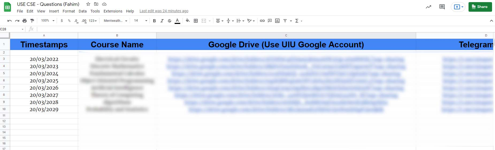
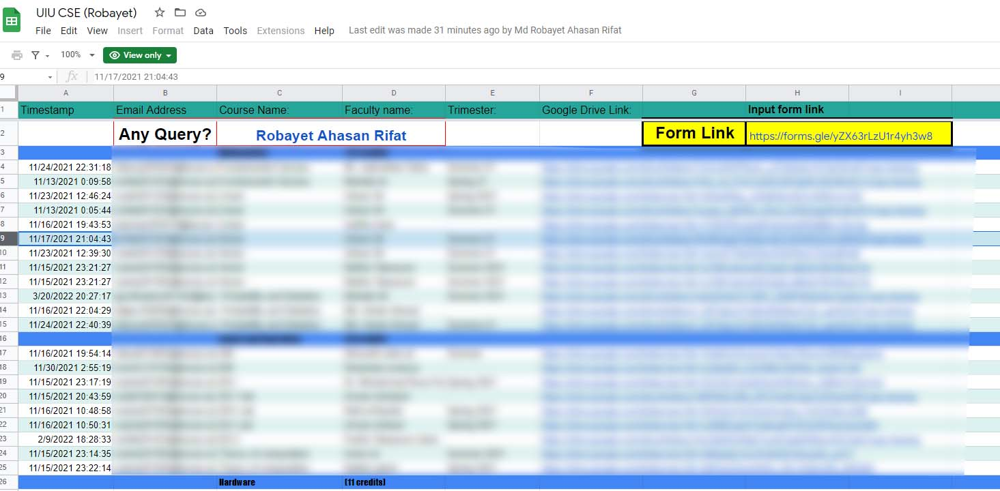

# Study Resources of United International University

## The biggest collection of educational resources of United International University

 

 

## 🚨 We have a discord server related to this project. Join using the invitation link from here: [Invitation Link](https://discord.gg/6ckYPXmSSK)

 

## ⚠️ If you can't access the folders, then use UIU provided Gmail account. We encourage you to always use the UIU provided Google Account.

 

## 🪲 If the link actually doesn't exist, then let us know in the discord server.

 

## 🙏 Support everyone by providing resources (Questions) you have. Send a mail to [fahimbinamin@gmail.com](mailto:fahimbinamin@gmail.com) with the resources or anything necessary for the students. 

 

## 📑 Questions of the Courses

### Use the [Google Sheet](https://docs.google.com/spreadsheets/d/1N43A4J_NYDzPlMT6URAw6yTkj0E1HT2GyWEwsKFls3o/edit?usp=sharing). All of the courses are being added and updated here frequently by me. Use your UIU provided Google account to access. If you can't view the sheet, then click `"Request Access"`. The sheet is also getting updated frequently.

 

 

## 🎥 Video Resources of the Courses

### Use the [Google Sheet](https://docs.google.com/spreadsheets/d/1ucoxBUG-Cf2zbpE71ehRNK5pEpmnpctLlaWasJu0faM/edit#gid=2111826296). All of the courses are being added and updated here frequently by our brother, [Md Robayet Ahasan Rifat](https://www.facebook.com/greatrifatt). Use your UIU provided Google account to access. If you can't view the sheet, then click `"Request Access"`.

 

 

## 🌟 Check out another Google Site created by one of our faculties regarding study resources: [UIU Portal CSE](https://sites.google.com/view/portalofuiu/departments/cse).  <i> It's very old and it isn't getting maintained anymore </i>

 

## 🌠 Check another website where you can find a lot of course material of CSE department. [UIU CSE COURSE MATERIALS](https://sites.google.com/bscse.uiu.ac.bd/uiucoursematerials/home)

 

<i> Best of Luck! </i>
