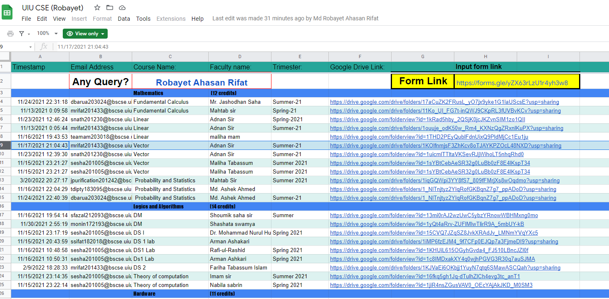

# Study Resources of United International University

## The biggest collection of educational resources of United International University

 

 

## 🚨 We have a discord server related to this project. Join using the invitation link from here: [Invitation Link](https://discord.gg/6ckYPXmSSK)

 

## ⚠️ If you can't access the folders, then use UIU provided Gmail account. We encourage you to always use the UIU provided Google Account.

 

## 🪲 If the link actually doesn't exist, then let us know in the discord server.

 

## 🙏 Support everyone by providing resources (Questions) you have. Send a mail to [fahimbinamin@gmail.com](mailto:fahimbinamin@gmail.com) with the resources or anything necessary for the students. 

 

## 🙏 Support everyone by providing resources (Videos) you have. [Use this Google form for that](https://docs.google.com/forms/d/e/1FAIpQLSc3WuForA9-3QiiNnLPtfDSZh4cPAGQoZ8iaK-wT27i7a_yQw/viewform?pli=1).

 

## 🎯 We don't support unethical tasks; therefore if any faculty wants to remove his/her resources, of course, we will remove that instantly.

 

## 🌟 Check out another Google Site created by one of our faculties regarding study resources: [UIU Portal CSE](https://sites.google.com/view/portalofuiu/departments/cse)

 

## 🎥 Video Resources of the Courses

### Use the [Google Sheet](https://docs.google.com/spreadsheets/d/1ucoxBUG-Cf2zbpE71ehRNK5pEpmnpctLlaWasJu0faM/edit#gid=2111826296). All of the courses are being added and updated here frequently by our brother, [Md Robayet Ahasan Rifat](https://www.facebook.com/greatrifatt). 

<i> Best of Luck! </i>