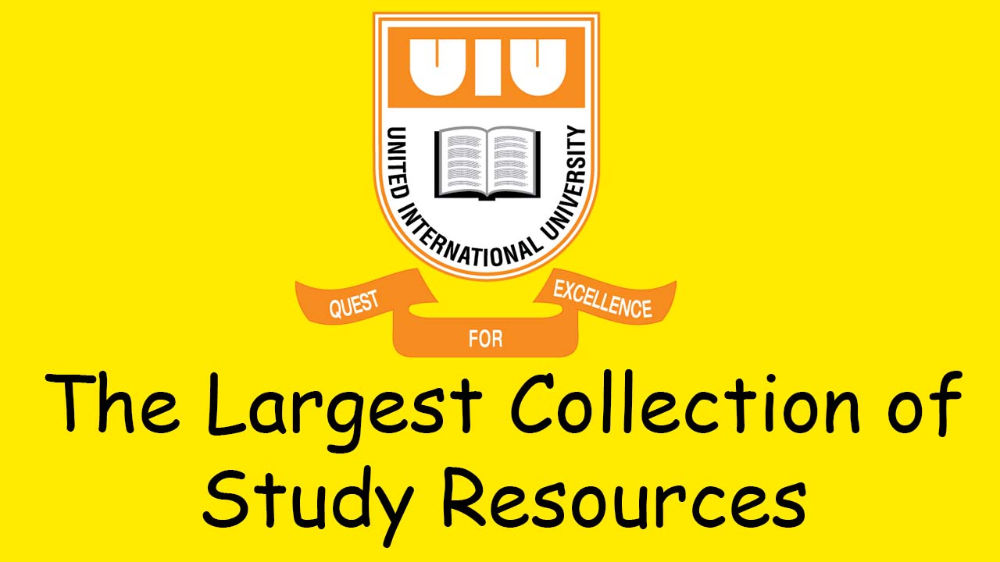

# Study Resources of United International University

## The biggest collection of educational resources of United International University

 

 

# ⭐ UIU's the largest Question Bank is becoming the largest RESOURCE BANK with all of the video content altogether! 👏

 

### CSE ডিপার্টমেন্ট ছাড়া অন্য ডিপার্টমেন্ট থেকে যদি সেসব ডিপার্টমেন্ট এর ডেটাও এই প্রশ্নব্যাংক এ অন্তর্ভুক্ত করতে চান, তবে সরাসরি ইমেইল করে জানান [fahimbinamin@gmail.com](mailto:fahimbinamin@gmail.com) ইমেইলে। আপনার সাথে যত দ্রুত সম্ভব যোগাযোগ করে পরবর্তী কার্যক্রম নিয়ে আমরা আলোচনা করব।

# 📹 Video Resources 

## ➡️  [Click here - USE your UIU provided Google account](https://docs.google.com/spreadsheets/d/1oyQ2w1x0SUIxx9xXzguE65YdeIhBm12-z6W5bd12Nko/edit?usp=sharing)

## ✨ অফিশিয়াল ফেইসবুক গ্রুপ: [জয়েন করুন](https://www.facebook.com/groups/620784936320616)

## ✨ আমাদের অফিশিয়াল ডিসকর্ড সার্ভার ও আছে এই প্রশ্নব্যাংক নিয়ে। চাইলে এই [ইনভাইটেশন লিংক](https://discord.gg/6ckYPXmSSK) দিয়ে জয়েন করতে পারেন।

  
## 🔰 নতুন আপডেট অনুযায়ী আপনি যদি সবকিছু এক্সেস করতে চান, তাহলে অবশ্যই আপনাকে নিচের রুলসগুলো মেনে চলতে হবেঃ

১।  আগে **SUMMER 2022** এর ক্লাস টেস্ট/নোট/মিড/ফাইনাল পরীক্ষার প্রশ্ন শেয়ার করতে হবে। সেসব ডকুমেন্টগুলো আপনাকে সবার আগে আপনাকে প্রতি আলাদা কোর্স এর জন্য আলাদা PDF ফাইল তৈরী করতে হবে এবং [uiustudyresources@gmail.com](mailto:uiustudyresources@gmail.com) ইমেইল এড্রেসে মেইল করে পাঠাতে হবে।  
২।  ইমেইল করার সময়ে আপনাদের ইউনিভার্সিটির মেইল আইডি ব্যবহার করবেন।  
৩।  **আপনি কোন কোন কোর্স এর এক্সেস চাইছেন সেটিও অবশ্যই উল্লেখ করে দিবেন। আপনি যেই কোর্সগুলো করছেন শুধুমাত্র সেই কোর্সগুলোরই এক্সেস পাবেন।** এরপরে আমরা সময় পাওয়া মাত্রই দ্রুত আপনাদের সেই ইমেইল এড্রেসে আপনার চাওয়া কোর্সগুলোর ফোল্ডার এর এক্সেস লিংক পাঠিয়ে দিব।  
৪।  এরপরে একটানা ২ টি মাস (মিড পর্যন্ত) আপনারা এক্সেস পাবেন।  
৫।  ফাইনাল পরীক্ষা পর্যন্ত এক্সেস পেতে একইভাবে আপনাদের উপরে দেয়া ইমেইল এড্রেসে আপনাদের রানিং কোর্স এর মিড পরীক্ষার ডকুমেন্ট পাঠাতে হবে। তাহলেই আবারো আপনার এক্সেস বাড়ানো হবে ফাইনাল পরীক্ষা পর্যন্ত।  
৬।  কয়টি ডকুমেন্ট পাঠাবেন তাতে কোনো বাঁধাধরা নিয়ম নেই, কিন্তু যত বেশি পাঠাবেন সবার জন্যই তত ভালো হবে।  
৭।  আপনাকে দেয়া রিসোর্সগুলো আপনি কারো সাথে শেয়ার করতে পারবেন না কোনোভাবেই।  
৮।  আমাদের এই সাপোর্ট সম্পূর্ণরূপে ফ্রী! কেউ যদি আপনার কাছে এসবে কোনো রকম অর্থ দাবী করে, সাথে সাথে আমাদের জানাবেন।  
৯।  আমাদের টীম মেম্বারদের কারো সাথে কোনোভাবেই খারাপ ব্যবহার করা যাবে না।  
১০। যদি আপনাকে দেয়া ফোল্ডারে কোনো সমস্যা পান (ফাইল মিসিং, একই ফাইল বার বার আছে, ব্লারি কোয়ালিটি বা অন্যকিছু) - তাহলে [uiustudyresources@gmail.com](mailto:uiustudyresources@gmail.com) ইমেইল এড্রেসে মেইল করে সেটি জানাবেন। আমরা সাধ্যমত চেষ্টা করব সমস্যাগুলোর সমাধান করতে।  

## 🔴 সবচেয়ে বড় ভিডিও ব্যাংক তৈরীর কাজও শুরু হয়ে গিয়েছে। আপনাদের কাছে যত ভিডিও কনটেন্ট আছে, সবগুলোই আপনারা ব্যাংক এ জমা দিতে পারেন। মেইল করে দিন  [uiustudyresources@gmail.com](mailto:uiustudyresources@gmail.com) ইমেইল এড্রেসে। 

## 🗨️ আপনাদের কারো যদি কোনো কমপ্লেইন থাকে কোনো ব্যাপারে অথবা সাজেশন থাকে, তাহলে সরাসরি জানাতে পারেন [fahimbinamin@gmail.com](mailto:fahimbinamin@gmail.com) ইমেইলে মেইল করে।

## 🪧 **PDF ফাইল ছাড়া কোনো ডকুমেন্ট গ্রহণ করা হবে না**। অবশ্যই আপনার PDF ফাইলগুলো যেন **স্পষ্ট বোধগম্য** হয় সেটি নিশ্চিত করতে হবে। ইমেজ ফাইল PDF করার জন্য অনেক ফ্রী ওয়েবসাইট ইন্টারনেটে পেয়ে যাবেন। অনেক ব্যবহ্রত একটি ফ্রী ওয়েবসাইট হলঃ [ilovepdf](https://www.ilovepdf.com/) যেটায় আপনারা একইসাথে অনেক কাজ করতে পারবেন সম্পূর্ণ বিনামূল্যে!

 

### ⚠️ যদি কেউ এক্সেস পাবার পরে ডেটা/ডকুমেন্ট অন্য কারো কাছে শেয়ার করেন এবং আমাদের কাছে রিপোর্ট আসে, তাহলে অতি দ্রুত তার জন্য সাময়িক ব্যান থেকে শুরু করে পার্মানেন্ট ব্যান পর্যন্ত হতে পারেন। ইউনাইটেড ইন্টারন্যাশনাল ইউনিভার্সিটির আন্ডারগ্রাজুয়েট প্রোগ্রামের কম্পিউটার সাইন্স এন্ড ইঞ্জিনিয়ারিং ডিপার্টমেন্ট এর সবচেয়ে বড় প্রশ্নব্যাংক টিকে সর্বদা আপডেটেড এবং রিসোর্সফুল রাখার জন্য এমন কড়াকড়ি সিদ্ধান্ত নিতে আমরা বাধ্য হয়েছি।

 

### Our Team Members:
* Md. Fahim Bin Amin (Founder)
* Fatema Akther Mumu
* Md. Asif Khan
* S. M Shihab Adnan Saad
* Muhammad Zakaria
* MD Shebli Shadek Shemul  
* Mahfuzur Rahman 
* Nur Hossain Nazim
* Nusrat Jahan
* Sheikh Tanvir Ahmed
* Shahriar Rahman Niloy

 

 

<i> Best of Luck! </i>
