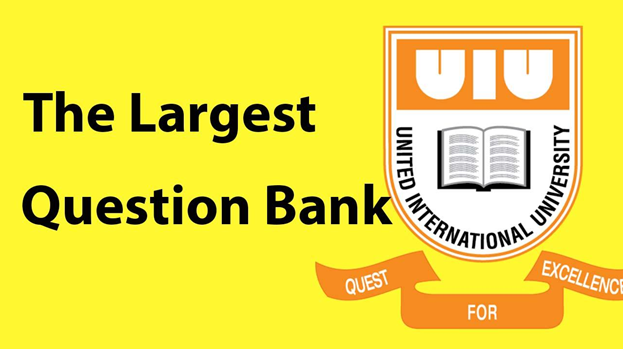

# Study Resources of United International University

## The biggest collection of educational resources of United International University

 

 

## 🚨 We have a discord server related to this project. Join using the invitation link from here: [Invitation Link](https://discord.gg/6ckYPXmSSK)

 

## ⚠️ If you can't access the folders, then use UIU provided Gmail account. We encourage you to always use the UIU provided Google Account.

 

## 🪲 If the link actually doesn't exist, then let us know in the discord server.

 

## 🙏 Support everyone by providing resources (Questions / Video Clips) you have. Send a mail to [fahimbinamin@gmail.com](mailto:fahimbinamin@gmail.com) with the resources or anything necessary for the students. 

 

## 🎯 We don't support unethical tasks; therefore if any faculty wants to remove his/her resources, of course, we will remove that instantly.

 

| index | Course Name     | Question | Video Clips                                                                              | Faculty       | Courtesy                               |
| ----- | --------------- | -------- | ---------------------------------------------------------------------------------------- | ------------- | -------------------------------------- |
| 001   | Compiler Theory |          | [Google Drive](https://drive.google.com/drive/folders/14QZgtuNxCF8Jc4D6h25X_5olYL0u-wzS) | Nahid Hossain | Md Robayet Ahasan Rifat & ssadiq182117 |
|       |                 |          |                                                                                          |               |                                        |
|       |                 |          |                                                                                          |               |                                        |

<i> This project is completely managed voluntarily by a single person. </i>